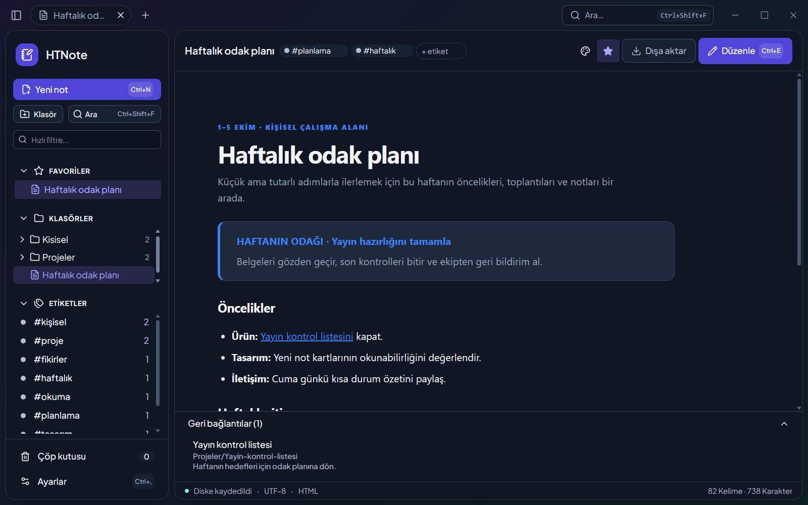
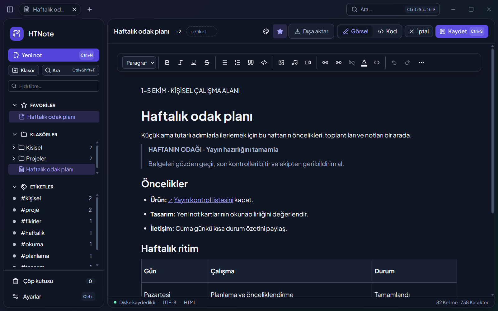
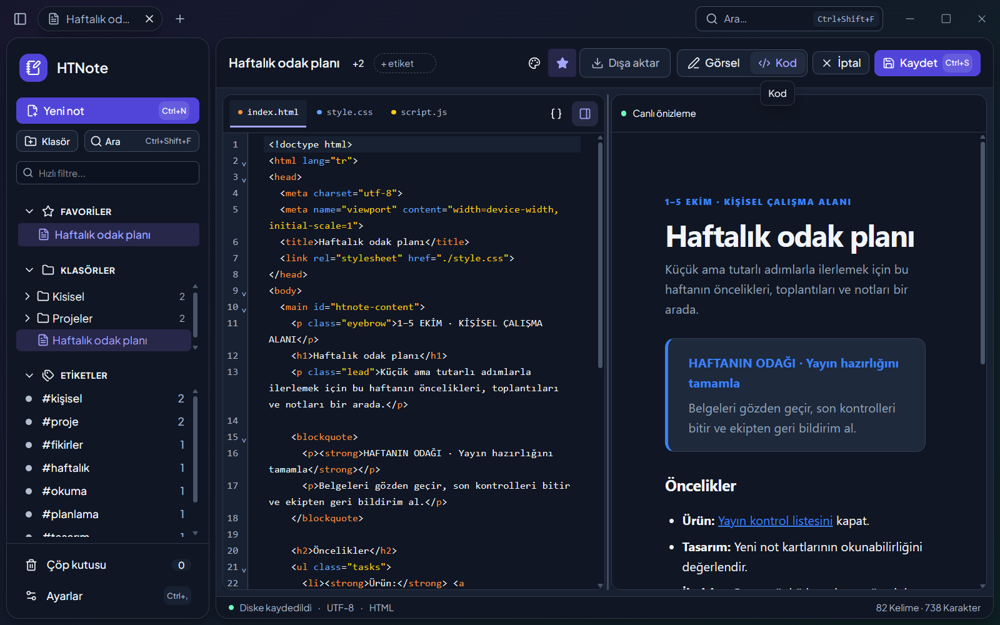
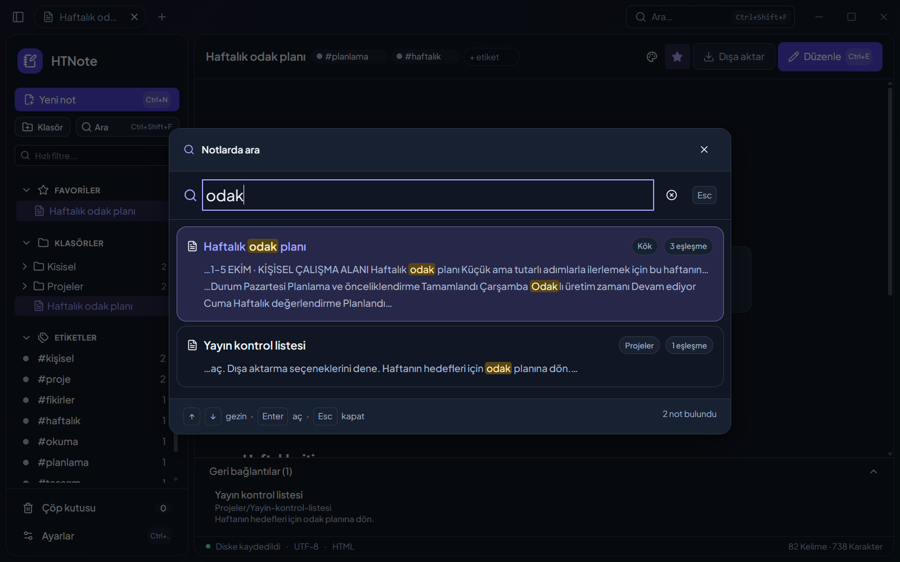
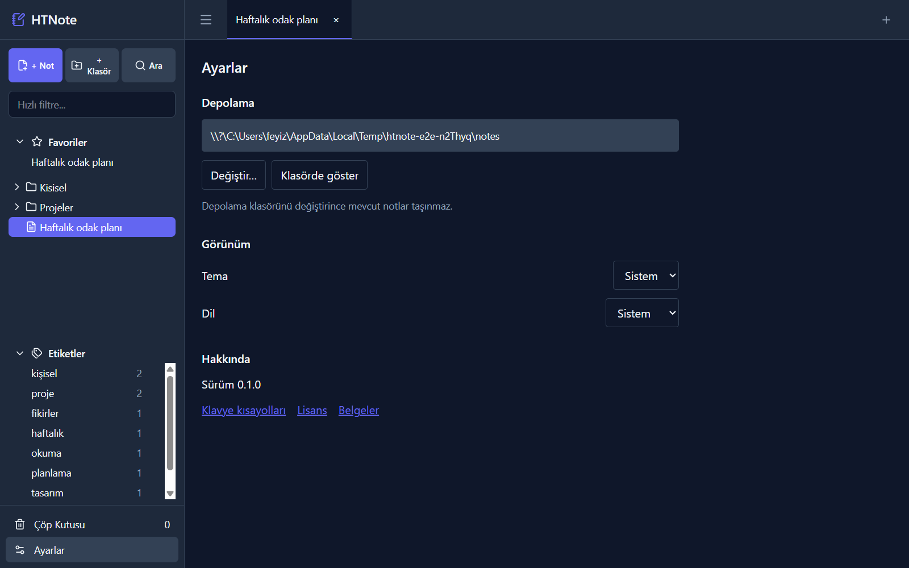

# HTNote 📝

> **HTML Temelli, İnteraktif ve Yerel-Öncelikli (Local-First) Masaüstü Not Alma Uygulaması**

HTNote; kullanıcıların notlarını açık standart olan **HTML, CSS ve JavaScript** ekosisteminde saklayan, modern, hafif ve tamamen internetsiz (offline) çalışan masaüstü not alma uygulamasıdır. Sıradan not defterlerinden farklı olarak notların içerisinde JavaScript çalıştırabilir, interaktif araçlar, hesaplamalar, ses kayıtları ve dinamik tablolar barındırabilirsiniz.

## Kurulum / Installation (Windows)

[Releases](https://github.com/fyzokty/htnote/releases) sayfasından `-setup.exe` (NSIS) veya `.msi` kurulum dosyasını indirin ve çalıştırın. Paketler imzalanmadığı için Windows SmartScreen uyarısı gösterebilir. Dosyayı bu projenin yayınından indirdiyseniz uyarıda **Ek bilgi (More info)**, ardından **Yine de çalıştır (Run anyway)** seçeneğini kullanabilirsiniz.

Kaynak koddan Windows kurulum paketleri üretmek için Node.js, Rust ve Windows derleme araçlarını kurup `npm ci` ve `npm run tauri build` çalıştırın.

## Hızlı kullanım

Sol ağaçtan not ve klasör oluşturun; bir nota tıklayınca sekmede görüntüleme modu açılır. **Düzenle** ile görsel editöre, editörde **Kod** ile HTML/CSS/JS ve canlı önizlemeye geçin. Resim, ses ve videoyu editöre bıraktığınızda dosyalar notun `assets/` klasörüne kopyalanır. `htnote://note/<uuid>` bağlantıları başka notları açar; geri bağlantılar, favoriler ve etiketler notlar arasında gezinmeyi kolaylaştırır.

Sol paneldeki filtre başlıkları hızla daraltır; **Arama** (`Ctrl+Shift+F`) notların tam metnini arar. Silinen not veya klasör çöp kutusuna taşınır; oradan geri yükleyebilir, kalıcı silebilir veya kutuyu boşaltabilirsiniz. Notu tek dosya HTML, ZIP ya da PDF olarak dışa aktarabilirsiniz. **Ayarlar** bölümünde not kökünü, sistem/açık/koyu temayı ve Türkçe/İngilizce dili seçin. Kısayol listesini `Ctrl+/` ile açın; `Ctrl+S` kaydeder, `Ctrl+E` düzenleme modunu değiştirir, `Ctrl+W` sekmeyi kapatır. macOS'ta ilgili kısayollarda `Ctrl` yerine `⌘` kullanılır.

Her not bir klasördür: `metadata.json`, `index.html` ve gerektiğinde `style.css`, `script.js`, `assets/` içerir. Ayrıntılar [not yazarlığı rehberinde](docs/note-authoring.md).

## Ekran görüntüleri

| Ana görünüm | Görsel editör | Kod editörü |
|---|---|---|
|  |  |  |

| Arama | Ayarlar |
|---|---|
|  |  |

Geliştiriciler bu görselleri `npm run docs:screenshots` ile fixture notlardan yeniden üretebilir.

## Lisans

Lisans henüz belirlenmedi.

## English summary

HTNote is an offline desktop note app that stores notes as local HTML, CSS, and JavaScript bundles. It offers visual and code editing, sandboxed viewing, search, tabs, media assets, and HTML, ZIP, and PDF export. Download Windows installers from [Releases](https://github.com/fyzokty/htnote/releases); see the [developer guide](docs/development.md) to build from source.

---

## 🌟 Temel Felsefe ve Öne Çıkan Özellikler

- **Açık Standart ve Veri Bağımsızlığı:** Notlarınız özel (proprietary) bir veritabanında değil; doğrudan diskinizde (`Belgeler/HTNote/`) standart `.html` dosyaları ve ilgili `assets/` klasörlerinde saklanır. Yarın bu uygulamayı silseniz bile notlarınızı herhangi bir web tarayıcısında çift tıklayarak görüntüleyebilirsiniz.
- **İnteraktif Notlar (HTML + CSS + JS):** Notlar sadece statik metin değildir. Notun içine JavaScript kodu ekleyebilir, mini hesap makineleri, dinamik grafikler veya interaktif kontrol listeleri oluşturabilirsiniz.
- **İzole & Güvenli Görüntüleme (Iframe Sandbox):** Not içindeki JavaScript kodları güvenli bir `<iframe>` havuzunda çalışır; ana masaüstü uygulamanıza veya işletim sisteminize zarar veremez.
- **Çift Modlu Çalışma:**
  - **Görüntüleme Modu (Varsayılan):** Notlar açıldığında salt okunur ve çalıştırılabilir web sayfası olarak açılır.
  - **Düzenleme Modu:** "Düzenle" butonuna tıklandığında açılır. Varsayılan olarak zengin görsel editör (WYSIWYG), istendiğinde ise canlı önizlemeli (Split View) HTML/CSS/JS kod editörü sunar.
- **Zengin Medya Desteği:** Resim, ses (`.mp3`, `.wav`) ve videoları sürükleyip bırakarak notun kendi `assets/` klasörüne otomatik kopyalama ve oynatma.
- **İç Linkleme (Notlar Arası Köprü):** Notların birbirine `htnote://note/<id>` formatında link verebilmesi, linke tıklandığında ilgili notun anında açılması ve geri bağlantıların (backlinks) görülebilmesi.
- **Favoriler ve Etiketler:** Notları favorilere ekleme, etiketleme ve etikete göre süzme.
- **Çoklu Sekme (Tab) Arayüzü:** Birden fazla notu aynı anda sekmeler halinde açık tutabilme.
- **İki Kademeli Arama:** Sol menüde anlık başlık/klasör filtreleme ve tüm notlar genelinde derinlemesine tam metin (Full-Text) araması.
- **Dosya Sistemi Senkronizasyonu (Zero-Cost Watcher):** İşletim sistemi dosya yöneticisinden (Explorer/Finder) yapılan klasör ve dosya değişikliklerini anlık olarak yakalama.
- **Dahili Çöp Kutusu (`.trash`):** Silinen notların kaybolmasını önleyen uygulama içi geri dönüşüm alanı.
- **Dışa Aktarma:** Notları tek dosya HTML, PDF veya ZIP paketi olarak dışa aktarabilme.

---

## 🛠️ Teknoloji Yığını (Tech Stack)

| Katman | Teknoloji | Seçim Sebebi |
|---|---|---|
| **Masaüstü Altyapısı** | **Tauri v2 (Rust)** | Minimum RAM kullanımı (~30-50MB), küçük dosya boyutu, yüksek güvenlik ve native OS API erişimi. |
| **Frontend Framework** | **React 18/19 + TypeScript + Vite** | Geniş kütüphane ekosistemi, güçlü tip güvenliği ve hızlı geliştirme döngüsü. |
| **Stil / Arayüz** | **Tailwind CSS** | Sıfır çalışma zamanı yükü (zero-runtime), modern ve esnek tasarım kabiliyeti. |
| **Görsel Editör (WYSIWYG)** | **TipTap (ProseMirror)** | Saf HTML çıktısı üretimi, genişletilebilir blok mimarisi, zengin metin deneyimi. |
| **Kod Editörü** | **CodeMirror 6** | Monaco'ya kıyasla aşırı hafif (~500KB), modüler, anında yüklenen HTML/CSS/JS editörü. |
| **Dosya İzleyici** | **Rust `notify` Crate** | İşletim sisteminin yerel dosya olaylarını (FSEvents, inotify, ReadDirectoryChangesW) CPU harcamadan dinleme. |
| **State** | **Zustand** | Hafif, az boilerplate. |
| **Sürükle-Bırak** | **@dnd-kit** | Pointer tabanlı; Tauri'nin dosya bırakma davranışıyla çakışmaz. |
| **i18n** | **i18next** | Türkçe / İngilizce arayüz. |

---

## 📚 Dokümantasyon İndeksi

Bu mimari planlama serisi projenin tüm yönlerini ele alan modüler dokümanlardan oluşur:

0. 🧭 [Mimari Karar Kaydı](docs/decisions.md) - **Yetkili kaynak**; diğer dokümanlarla çelişkide bu geçerlidir.
1. 📋 [Özellikler ve Fonksiyonel Spesifikasyon](docs/features.md) - Uygulamanın tüm yetenekleri, kullanıcı akışları ve iş kuralları.
2. 🗄️ [Veri Yapısı ve Depolama Standardı](docs/data-structure.md) - Not paket formatı, `metadata.json`, HTML `<head>` eşleşmesi ve dizin hiyerarşisi.
3. 🏗️ [Teknik Mimari ve Güvenlik](docs/architecture.md) - Tauri/Rust backend, React frontend, IPC haberleşmesi, iframe sandbox ve `postMessage` protokolü.
4. 🎨 [UI / UX Spesifikasyonu](docs/ui-ux-spec.md) - Arayüz bileşenleri, layout yerleşimi, split-view kodlama ve klavye kısayolları.
5. 🚀 [Uygulama Yol Haritası (Roadmap)](docs/roadmap.md) - Sıfırdan çalışan bir MVP'ye adım adım geliştirme aşamaları.
6. 🛠️ [Geliştirme rehberi](docs/development.md) - Kurulum, doğrulama ve sürüm akışı.
7. ✍️ [Not yazarlığı](docs/note-authoring.md) - Not paketi, tema ve bağlantılar.
8. 📜 [Değişiklik günlüğü](CHANGELOG.md) - Sürüm özeti.
