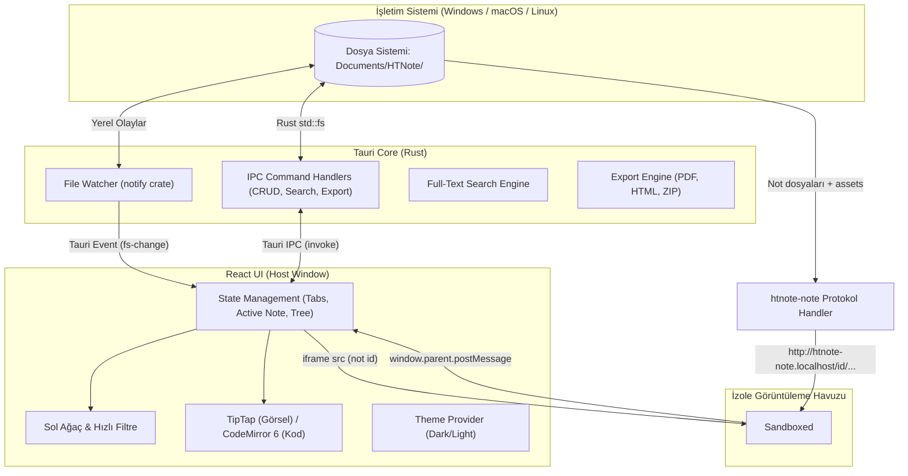

# HTNote - Teknik Mimari ve Güvenlik Modeli 🏗️

Bu doküman, HTNote uygulamasının teknik bileşenlerini, veri akışını, Rust ve Frontend arasındaki IPC (Inter-Process Communication) protokolünü ve kritik güvenlik izolasyonu modelini tanımlar.

> ⚠️ **Karar kaydı önceliklidir:** Bu doküman ile [`decisions.md`](decisions.md) çelişirse `decisions.md` geçerlidir.

---

## 1. Mimari Kuşbakışı (High-Level Architecture)



---

## 2. Güvenlik Modeli: JavaScript İzolasyonu (Iframe Sandbox)

HTNote'un en güçlü özelliği olan *"Not içinde serbest JavaScript çalıştırabilme"* yeteneği, aynı zamanda en büyük güvenlik riskini barındırır. Tauri uygulamalarında ana pencere (`window.__TAURI__`), işletim sistemine dosya silme, komut çalıştırma gibi doğrudan erişim yetkilerine sahiptir.

### İzolasyon Stratejisi:
Notun `index.html` içeriği ana arayüze **kesinlikle doğrudan enjekte edilmez** (`dangerouslySetInnerHTML` kullanılmaz).

Görüntüleme Modunda not, **ana uygulamadan farklı bir origin'den** (özel `htnote-note` protokolü) yüklenen izole bir `<iframe>` içinde çalıştırılır (bkz. `decisions.md` D08):

```html
<iframe
  id="htnote-viewer"
  sandbox="allow-scripts allow-forms allow-same-origin allow-modals"
  src="http://htnote-note.localhost/<note-id>/index.html"
  style="width: 100%; height: 100%; border: none;"
></iframe>
```

> ⚠️ `allow-scripts` ile `allow-same-origin` birlikte **yalnızca** iframe farklı bir origin'den yüklendiğinde güvenlidir. Not asla ana uygulama origin'inden (`tauri.localhost`) veya `srcdoc` ile yüklenmez; aksi halde script sandbox'ı kaldırıp `window.parent.__TAURI__`'ye erişebilir.

### Güvenlik Kuralları:
1. **Tauri IPC İzolasyonu:** Tauri capability'leri yalnızca ana pencere/origin için tanımlıdır; `<iframe>` içerisindeki JavaScript kodları `window.__TAURI__` nesnesine **erişemez**. Kullanıcı notuna `fetch()` veya döngü yazsa bile Tauri'nin yerel disk veya terminal API'lerini tetikleyemez.
2. **Top-Navigation Engeli:** `allow-top-navigation` izni **verilmez**. Böylece not içerisindeki bir script, ana Tauri uygulamasını harici bir URL'ye yönlendiremez.
3. **Storage Ayrımı:** Iframe içerisindeki `localStorage` ve `sessionStorage` ana uygulamanın state'lerinden tamamen izoledir. (Kabul edilen risk: tüm notlar aynı `htnote-note` origin'ini paylaşır.)
4. **Popup / İndirme Engeli:** `allow-popups` ve `allow-downloads` verilmez; harici linkler bridge üzerinden sistem tarayıcısında açılır.
5. **Protokol Handler:** Yalnızca indeksteki notların dizinleri altındaki dosyaları sunar (path traversal koruması).

---

## 3. İç Linkler ve `postMessage` İletişim Protokolü

Notun içerisindeki iç linkler (`htnote://...`) tıklandığında sayfanın kırılmaması ve ana uygulamada sekme açılması için standart `postMessage` protokolü kullanılır:

### 3.1. Iframe İçine Enjekte Edilen Hafif Köprü Scripti (Runtime Bridge):
Protokol handler HTML yanıtlarına `<script src="/__htnote/bridge.js">` ekler. Mesaj tablosunun tamamı `decisions.md` D09'dadır. Link yakalamanın özü:
```javascript
document.addEventListener('click', (e) => {
  const target = e.target.closest('a');
  const href = target?.getAttribute('href');
  if (href?.startsWith('htnote://note/')) {
    e.preventDefault();
    const id = href.slice('htnote://note/'.length);
    window.parent.postMessage({ type: 'HTNOTE_OPEN_NOTE', payload: { id } }, '*');
  }
});
```

### 3.2. Host React Uygulamasındaki Karşılama:
```typescript
useEffect(() => {
  const handleMessage = (event: MessageEvent) => {
    // Yalnızca kendi iframe'imizden ve not origin'inden gelen mesajlar işlenir
    if (event.source !== iframeRef.current?.contentWindow) return;
    if (event.origin !== NOTE_ORIGIN) return;
    if (event.data?.type === 'HTNOTE_OPEN_NOTE') {
      const { id } = event.data.payload;
      openNoteById(id); // Açıksa o sekmeye geçer, değilse yeni sekmede açar
    }
  };
  window.addEventListener('message', handleMessage);
  return () => window.removeEventListener('message', handleMessage);
}, []);
```

---

## 4. Rust Backend ve IPC Komutları

React ön yüzü ile Rust arka planı arasındaki standart komut sözleşmesi (Tauri Commands):

Bu tablo `src-tauri/src/lib.rs` içindeki `generate_handler!` kaydıyla eşleşir. Notlar UUID `id` ile, klasörler kök dizine göre göreli yolla adreslenir. Parametre adları Rust tarafındaki adları gösterir; frontend IPC yükünde camelCase kullanılır. Komutlar `Result<T, AppError>` döner; hata `{ code, message }` biçimindedir.

| Komut Adı | Parametreler | Dönüş Tipi | Açıklama |
|---|---|---|---|
| `app_info` | — | `AppInfo` | Uygulama sürümü. |
| `get_settings` | — | `Settings` | Kayıtlı ayarlar. |
| `update_settings` | `patch: SettingsPatch` | `Settings` | Ayarları günceller. |
| `set_root_dir` | `path: String` | `Settings` | Not kökünü değiştirir. |
| `get_root_dir` | — | `String` | Etkin not kökü. |
| `get_note_origin` | — | `String` | İzole not sunucusu origin'i. |
| `get_note_tree` | — | `Vec<TreeNode>` | Not ve klasör ağacı. |
| `search_notes` | `query: String, limit?: usize` | `SearchNotesResult` | Tam metin araması. |
| `get_backlinks` | `id: UUID` | `Vec<BacklinkItem>` | Geri bağlantılar. |
| `get_broken_links` | `id: UUID` | `Vec<BrokenLinkItem>` | Kırık iç bağlantılar. |
| `read_note` | `id: UUID` | `NoteData` | Not içeriği ve metadata. |
| `save_note` | `id: UUID, payload: SaveNoteInput` | `SaveNoteOutput` | Notu kaydeder. |
| `export_single_html` | `id: UUID, target_path: String` | `ExportResult` | Tek dosya HTML. |
| `export_zip` | `id: UUID, target_path: String` | `ExportResult` | ZIP paketi. |
| `export_pdf` | `id: UUID, target_path: String` | `ExportResult` | PDF. |
| `update_metadata` | `id: UUID, patch: MetadataPatch` | `MetadataUpdateResult` | Başlık, etiket ve favori metadata'sı. |
| `copy_asset` | `note_id: UUID, source_path: String` | `AssetInfo` | Dosyayı nota kopyalar. |
| `open_note_asset` | `note_id: UUID, rel_path: String` | `()` | Yalnızca notun `assets/` altındaki normal dosyaları, canonical yol ve uzantı allowlist denetiminden sonra Rust opener ile açar. |
| `save_asset_bytes` | `note_id: UUID, suggested_name: String, bytes: Vec<u8>` | `AssetInfo` | Medya baytlarını kaydeder. |
| `write_draft` | `id: UUID, payload: WriteDraftInput` | `()` | Taslak yazar. |
| `read_draft` | `id: UUID` | `DraftData` | Taslak okur. |
| `delete_draft` | `id: UUID` | `()` | Taslağı siler. |
| `list_drafts` | — | `Vec<DraftData>` | Taslakları listeler. |
| `set_preview_draft` | `id: UUID, html/css/js: String` | `u64` | Canlı önizleme içeriği. |
| `clear_preview_draft` | `id: UUID` | `()` | Önizleme taslağını kaldırır. |
| `create_note` | `parent_rel_path: String, title?: String` | `TreeNode` | Not oluşturur. |
| `create_folder` | `parent_rel_path: String, name: String` | `TreeNode` | Klasör oluşturur. |
| `rename_note` | `id: UUID, new_title: String` | `TreeNode` | Notu yeniden adlandırır. |
| `rename_folder` | `rel_path: String, new_name: String` | `TreeNode` | Klasörü yeniden adlandırır. |
| `move_item` | `rel_path: String, target_folder_rel_path: String` | `String` | Öğeyi taşır. |
| `reveal_in_explorer` | `rel_path: String` | `()` | Öğeyi dosya yöneticisinde gösterir. |
| `delete_item` | `rel_path: String` | `TrashItem` | Öğeyi çöp kutusuna taşır. |
| `list_trash` | — | `Vec<TrashItem>` | Çöp kutusunu listeler. |
| `restore_from_trash` | `trash_id: String` | `String` | Öğeyi geri yükler. |
| `delete_permanently` | `trash_id: String` | `()` | Öğeyi kalıcı siler. |
| `empty_trash` | — | `()` | Çöp kutusunu boşaltır. |

---

## 5. Sıfır Maliyetli Dosya İzleyici (Rust `notify` Watcher)

- Rust tarafında `notify::RecommendedWatcher` kullanılarak `Documents/HTNote/` dizini özyinelemeli (recursive) olarak izlenir.
- **Debouncing:** Arka arkaya gelen işletim sistemi dosya olayları 250ms'lik bir gecikme ile filtrelenir (aynı anda onlarca dosya kopyalanırken arayüzün kilitlenmesi engellenir).
- Bir değişiklik tespit edildiğinde React ön yüzüne `app.emit("fs-change", payload)` sinyali gönderilir.
- React tarafı sol ağacı sessizce ve akıcı bir şekilde yeniden render eder.
