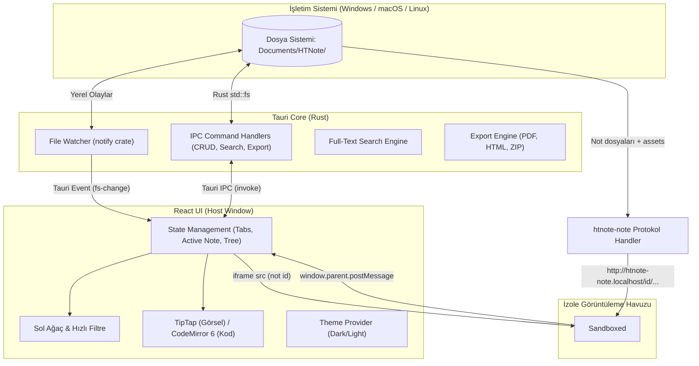

# HTNote - Teknik Mimari ve Güvenlik Modeli 🏗️

Bu doküman, HTNote uygulamasının teknik bileşenlerini, veri akışını, Rust ve Frontend arasındaki IPC (Inter-Process Communication) protokolünü ve kritik güvenlik izolasyonu modelini tanımlar.

> ⚠️ **Karar kaydı önceliklidir:** Bu doküman ile [`decisions.md`](decisions.md) çelişirse `decisions.md` geçerlidir.

---

## 1. Mimari Kuşbakışı (High-Level Architecture)



---

## 2. Güvenlik Modeli: JavaScript İzolasyonu (Iframe Sandbox)

HTNote'un en güçlü özelliği olan *"Not içinde serbest JavaScript çalıştırabilme"* yeteneği, aynı zamanda en büyük güvenlik riskini barındırır. Tauri uygulamalarında ana pencere (`window.__TAURI__`), işletim sistemine dosya silme, komut çalıştırma gibi doğrudan erişim yetkilerine sahiptir.

### İzolasyon Stratejisi:
Notun `index.html` içeriği ana arayüze **kesinlikle doğrudan enjekte edilmez** (`dangerouslySetInnerHTML` kullanılmaz).

Görüntüleme Modunda not, **ana uygulamadan farklı bir origin'den** (özel `htnote-note` protokolü) yüklenen izole bir `<iframe>` içinde çalıştırılır (bkz. `decisions.md` D08):

```html
<iframe
  id="htnote-viewer"
  sandbox="allow-scripts allow-forms allow-same-origin allow-modals"
  src="http://htnote-note.localhost/<note-id>/index.html"
  style="width: 100%; height: 100%; border: none;"
></iframe>
```

> ⚠️ `allow-scripts` ile `allow-same-origin` birlikte **yalnızca** iframe farklı bir origin'den yüklendiğinde güvenlidir. Not asla ana uygulama origin'inden (`tauri.localhost`) veya `srcdoc` ile yüklenmez; aksi halde script sandbox'ı kaldırıp `window.parent.__TAURI__`'ye erişebilir.

### Güvenlik Kuralları:
1. **Tauri IPC İzolasyonu:** Tauri capability'leri yalnızca ana pencere/origin için tanımlıdır; `<iframe>` içerisindeki JavaScript kodları `window.__TAURI__` nesnesine **erişemez**. Kullanıcı notuna `fetch()` veya döngü yazsa bile Tauri'nin yerel disk veya terminal API'lerini tetikleyemez.
2. **Top-Navigation Engeli:** `allow-top-navigation` izni **verilmez**. Böylece not içerisindeki bir script, ana Tauri uygulamasını harici bir URL'ye yönlendiremez.
3. **Storage Ayrımı:** Iframe içerisindeki `localStorage` ve `sessionStorage` ana uygulamanın state'lerinden tamamen izoledir. (Kabul edilen risk: tüm notlar aynı `htnote-note` origin'ini paylaşır.)
4. **Popup / İndirme Engeli:** `allow-popups` ve `allow-downloads` verilmez; harici linkler bridge üzerinden sistem tarayıcısında açılır.
5. **Protokol Handler:** Yalnızca indeksteki notların dizinleri altındaki dosyaları sunar (path traversal koruması).

---

## 3. İç Linkler ve `postMessage` İletişim Protokolü

Notun içerisindeki iç linkler (`htnote://...`) tıklandığında sayfanın kırılmaması ve ana uygulamada sekme açılması için standart `postMessage` protokolü kullanılır:

### 3.1. Iframe İçine Enjekte Edilen Hafif Köprü Scripti (Runtime Bridge):
Protokol handler HTML yanıtlarına `<script src="/__htnote/bridge.js">` ekler. Mesaj tablosunun tamamı `decisions.md` D09'dadır. Link yakalamanın özü:
```javascript
document.addEventListener('click', (e) => {
  const target = e.target.closest('a');
  const href = target?.getAttribute('href');
  if (href?.startsWith('htnote://note/')) {
    e.preventDefault();
    const id = href.slice('htnote://note/'.length);
    window.parent.postMessage({ type: 'HTNOTE_OPEN_NOTE', payload: { id } }, '*');
  }
});
```

### 3.2. Host React Uygulamasındaki Karşılama:
```typescript
useEffect(() => {
  const handleMessage = (event: MessageEvent) => {
    // Yalnızca kendi iframe'imizden ve not origin'inden gelen mesajlar işlenir
    if (event.source !== iframeRef.current?.contentWindow) return;
    if (event.origin !== NOTE_ORIGIN) return;
    if (event.data?.type === 'HTNOTE_OPEN_NOTE') {
      const { id } = event.data.payload;
      openNoteById(id); // Açıksa o sekmeye geçer, değilse yeni sekmede açar
    }
  };
  window.addEventListener('message', handleMessage);
  return () => window.removeEventListener('message', handleMessage);
}, []);
```

---

## 4. Rust Backend ve IPC Komutları

React ön yüzü ile Rust arka planı arasındaki standart komut sözleşmesi (Tauri Commands):

> Bu tablo başlangıç taslağıdır; güncel ve tam komut listesi task'larda tanımlanır. Notlar **id** ile, klasörler kök dizine göre **göreli yol** ile adreslenir; aşağıdaki `note_path` parametreleri `note_id` olarak uygulanır. Hatalar `AppError { code, message }` döner (D18).

| Komut Adı | Parametreler | Dönüş Tipi | Açıklama |
|---|---|---|---|
| `get_note_tree` | `root_dir: String` | `Vec<TreeNode>` | Klasör ağacını ve altındaki notları `metadata.json` ile birlikte getirir. |
| `read_note` | `note_path: String` | `NoteData` | `metadata.json`, `index.html`, `style.css`, `script.js` içeriklerini döndürür. |
| `save_note` | `note_path: String, data: SaveNotePayload` | `Result<(), String>` | Not dosyalarını diske yazar, metadata ve `<head>` etiketlerini senkronize eder. |
| `create_note` | `folder_path: String, title: String` | `NoteData` | Temiz bir not paketi (klasör + `index.html` + `metadata.json`) üretir. |
| `delete_note` | `note_path: String` | `Result<(), String>` | Not klasörünü `.trash/` dizinine taşır. |
| `restore_from_trash`| `trash_item_id: String` | `Result<(), String>` | Çöp kutusundaki notu orijinal yerine geri taşır. |
| `empty_trash` | - | `Result<(), String>` | `.trash/` klasörünü tamamen temizler. |
| `copy_asset` | `note_path: String, file_path: String` | `String` (Yeni göreceli yol) | Sürüklenen medyayı notun `assets/` klasörüne kopyalar. |
| `search_notes` | `query: String` | `Vec<SearchResult>` | Tüm notların `index.html` metinlerinde arama yapar. |
| `export_note` | `note_path: String, format: "pdf" \| "html" \| "zip"` | `String` (Çıktı dosya yolu) | Notu istenen formatta dışa aktarır. |

---

## 5. Sıfır Maliyetli Dosya İzleyici (Rust `notify` Watcher)

- Rust tarafında `notify::RecommendedWatcher` kullanılarak `Documents/HTNote/` dizini özyinelemeli (recursive) olarak izlenir.
- **Debouncing:** Arka arkaya gelen işletim sistemi dosya olayları 250ms'lik bir gecikme ile filtrelenir (aynı anda onlarca dosya kopyalanırken arayüzün kilitlenmesi engellenir).
- Bir değişiklik tespit edildiğinde React ön yüzüne `app.emit("fs-change", payload)` sinyali gönderilir.
- React tarafı sol ağacı sessizce ve akıcı bir şekilde yeniden render eder.
